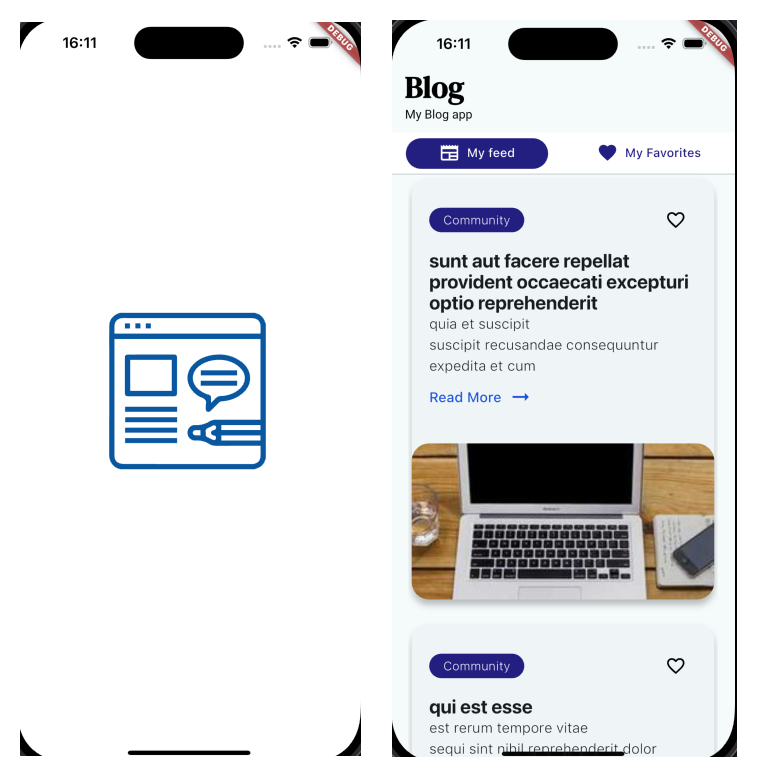
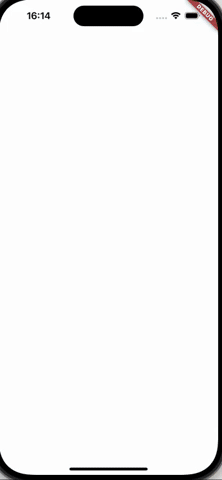

# My Blog App

An app to watch the newest posts about the tech releases and innovations. Choose your favorite post save it to read anytime and anywhere with an interactive interface.

## We used Flutter to build this App

- Flutter 3.24
- Dart 3.5
- Flutter BloC(flutter_bloc) 8.1.4

## Screenshots
Splash Screen & Home Screen


## Instructions

#### Run Locally

Clone the project

```bash
  git clone https://github.com/paolojoaquinp/my_blog_app
```

Go to the project directory

```bash
  cd my_blog_app
```

Install dependencies

```bash
  flutter pub get
```

Start the App

```bash
  flutter run -d <id-of-your-device-or-simulator>
```


## Features

- Unit Testing of Each module
- Splash Screen
- Home Screen
- Nested App Bar
- Interactive TabBar
- All Posts Tab with Animation
- Favorites Tab


## Video Demo




## Running Tests

To run the unit tests, run the following command

```bash
  flutter test
```

## 🚀 About Me

Experienced Software Engineer with a strong focus on Flutter, bringing over 4 years of expertise to the
table. Distinguished as Flutter La Paz Lead, with notable contributions, including Staffing at Multiple
events in GDG La Paz and Fluter La Paz. Acknowledged speaker at various events in Ecuador, Uruguay
and Bolivia, such as Flutter Ecuador, Flutter Uruguay, DevFest and Google IO. Successfully lead the
development of FireGuard LP, a robust platform of forest fire prevention in Flutter. Currently, a
dedicated Flutter Developer for CAWU STCA, a Canadian Company. Proactive and solution-oriented,
showcasing exceptional communication skills and leadership in managing small team projects.

## License

[MIT](https://choosealicense.com/licenses/mit/)


## Support

For support, email me paolojoaquinpintoperez@gmail.com

